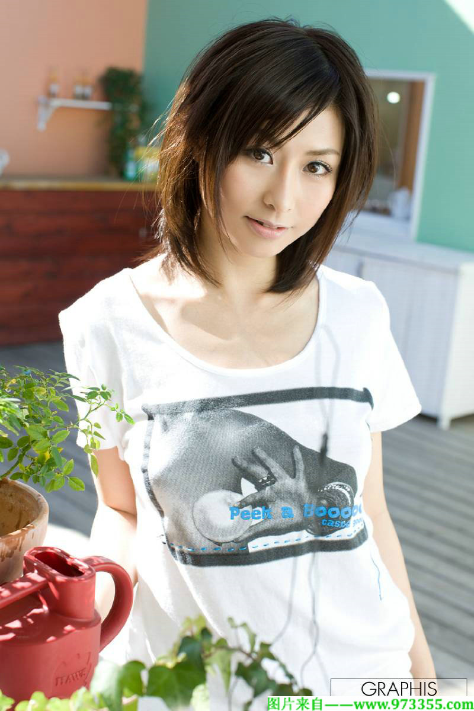
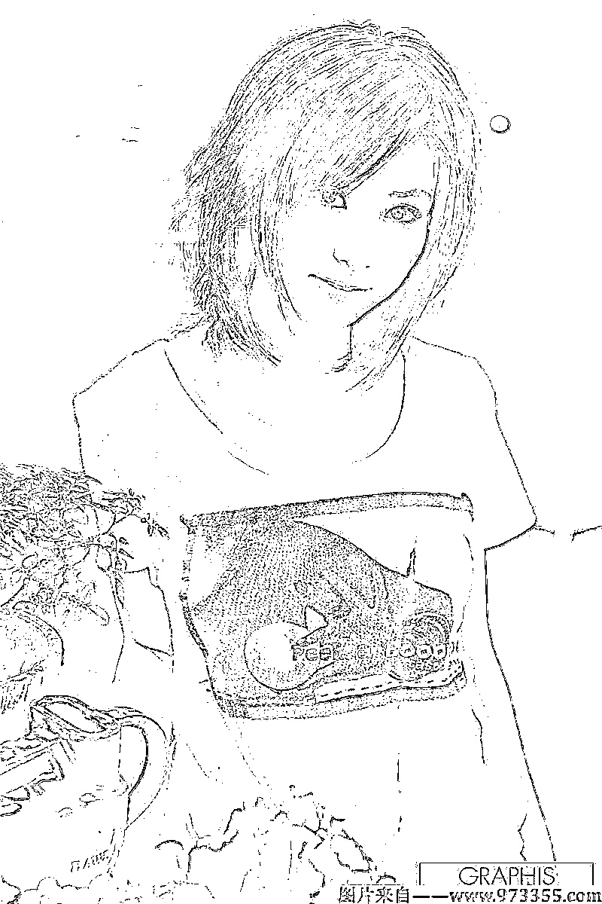
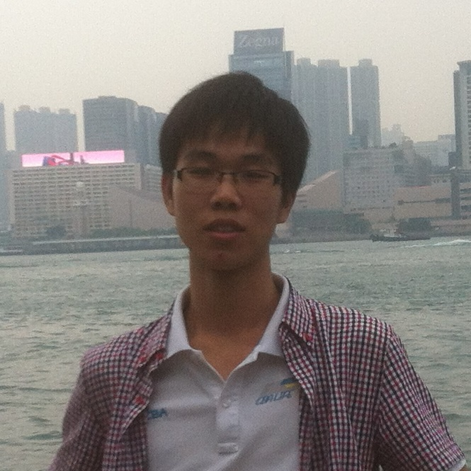
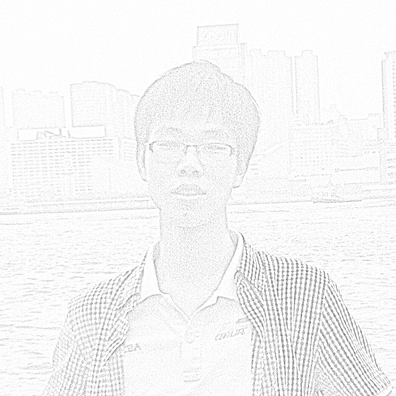
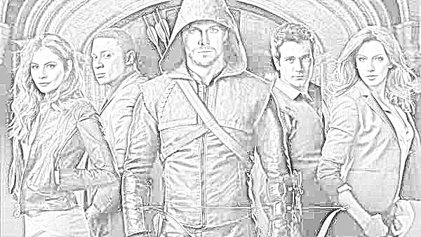
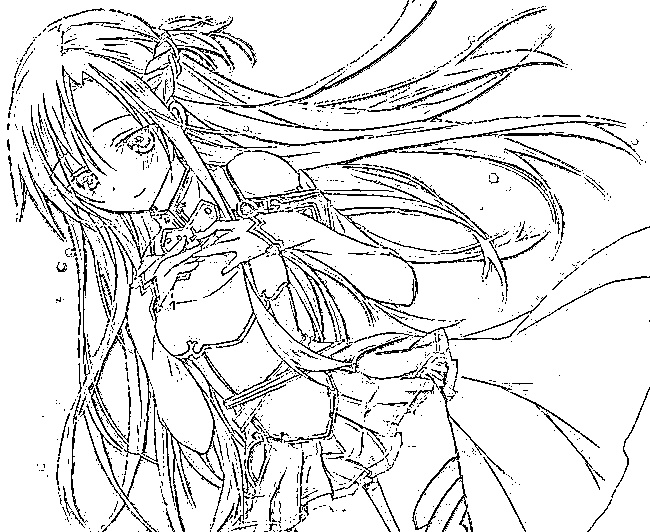

# 图像处理大作业

## 一、效果

## 二、算法
### 算法1
//【1】灰度图
//【2】过滤器
//【3】二值化滤波图  MatBinaryGrayLvbo
//【4】边缘检测滤波图  MatBinaryGrayLvbo
//【5】通过边缘检测来对MatBinaryGrayLvbo去噪

### 算法2
//【1】灰度图
//【2】反色
//【3】高斯模糊,高斯核的Size与最后的效果有关  
//【4】融合：颜色减淡
